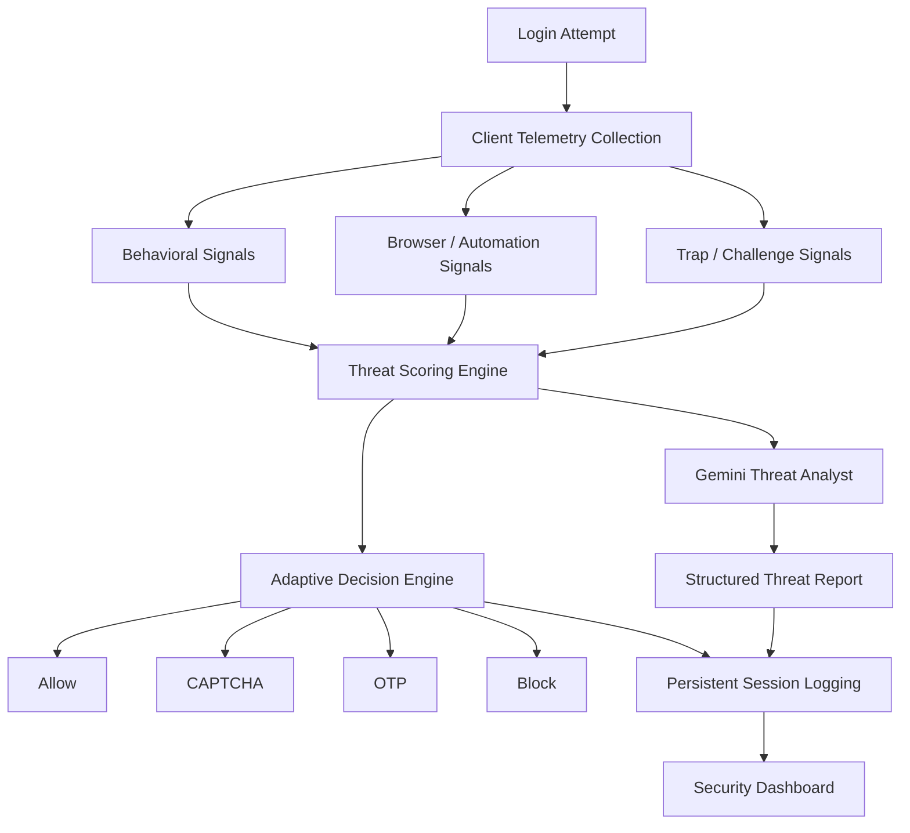

# AI-Powered Bot Detection & Threat Intelligence Platform

A resume-focused full-stack cybersecurity project that detects suspicious login activity, applies adaptive verification controls, and generates analyst-style threat intelligence reports using Google's Gemini API.

This project is designed to feel like a lightweight security product rather than a classroom demo. It combines browser-side telemetry, server-side threat scoring, adaptive authentication, persistent session logging, attack simulation, and AI-generated reporting in one workflow.

## Why This Project Stands Out

- Behavioral bot detection using timing, typing, mouse, and browser fingerprint signals
- Adaptive response engine with allow, CAPTCHA, OTP, and block actions
- Gemini-powered threat analyst layer that converts raw detection signals into professional security reports
- Security dashboard with session logs, risk distributions, response metrics, and explainable AI details
- Persistent storage with PostgreSQL support and file-based fallback for local demos
- Built-in suspicious session, Selenium, Playwright, and Puppeteer simulations

## Resume-Ready Highlights

- Built an AI-assisted cybersecurity platform that combines behavioral bot detection, adaptive authentication, and natural-language threat analysis
- Integrated Google Gemini 2.5 Flash to generate structured threat intelligence reports from raw login security signals
- Developed a full-stack threat intelligence workflow with Express, JavaScript, PostgreSQL-ready persistence, and enterprise-style security analytics
- Implemented explainable risk scoring, CAPTCHA/OTP escalation, and analyst-facing dashboard views for security operations storytelling

## Current Feature Set

### 1. Threat Scoring Engine

The backend scoring engine evaluates each login attempt and produces:

- Threat score from `0-100`
- Threat level: `SAFE`, `SUSPICIOUS`, `HIGH_RISK`, `CRITICAL`
- Classification: `HUMAN` or `BOT`
- Confidence percentage
- Explainability signals that describe why the score was assigned

Signals currently include:

- WebDriver and headless browser markers
- Selenium, Playwright, and Puppeteer fingerprints
- Suspicious user-agent patterns
- Mouse movement scarcity
- Rapid submission timing
- Typing cadence
- Honeypot/trap interactions
- Repeated local risk context

### 2. Adaptive Response Engine

After scoring a session, the platform applies a response action:

- `ALLOW_ACCESS`
- `SHOW_CAPTCHA`
- `REQUIRE_OTP`
- `BLOCK_SESSION`

This gives the project a practical security workflow instead of a binary allow/deny demo.

### 3. AI Threat Analyst Layer

The app includes a backend Gemini integration in [server/geminiThreatAnalyst.js](server/geminiThreatAnalyst.js) that transforms technical indicators into structured analyst output:

- Executive Summary
- Threat Assessment
- Risk Assessment
- Recommended Action
- Analyst Notes

If `GEMINI_API_KEY` is missing or Gemini is unavailable, the platform falls back to a local analyst-style report so the threat pipeline still works.

### 4. Security Dashboard

The admin dashboard at `/admin.html` includes:

- Session totals
- Human vs bot counts
- Blocked session counts
- Average risk score
- Active threats
- Threat level distribution
- Adaptive action distribution
- Session logs table
- Explainable AI detail panel
- AI Threat Analyst panel for selected sessions

### 5. Attack Simulation Center

The landing page includes a simulation area for testing the detection pipeline with:

- Suspicious session simulation
- Selenium simulation
- Playwright simulation
- Puppeteer simulation

These are useful for demos, screenshots, and interview walkthroughs.

## Product Flow



## Tech Stack

- **Frontend:** Vanilla JavaScript, HTML, CSS
- **Backend:** Node.js, Express
- **AI Reporting:** Google Gemini 2.5 Flash via `@google/generative-ai`
- **Persistence:** PostgreSQL-ready storage with JSON/CSV fallback
- **Bot Simulation:** Selenium, Playwright, Puppeteer
- **Environment Loading:** `dotenv`

## Project Structure

```text
.
├── api/                     # Serverless entrypoint for deployment targets
├── bots/                    # Automation attack scripts
├── public/                  # Landing page, dashboard, styles, frontend logic
├── server/                  # Express app, scoring, storage, Gemini analyst
├── storage/                 # Local persistence fallback files
├── .env.example             # Example environment variables
├── package.json
└── README.md
```

Key files:

- [public/index.html](public/index.html) - Landing page, login gateway, AI report card, simulation center
- [public/admin.html](public/admin.html) - Security dashboard and analyst views
- [public/app.js](public/app.js) - Client-side telemetry, login flow, live simulation UI
- [public/admin.js](public/admin.js) - Dashboard metrics, logs, detail rendering
- [server/app.js](server/app.js) - Main API routes and decision workflow
- [server/aiScoring.js](server/aiScoring.js) - Threat scoring logic
- [server/geminiThreatAnalyst.js](server/geminiThreatAnalyst.js) - Gemini integration and fallback reports
- [server/storage.js](server/storage.js) - PostgreSQL/file persistence layer

## Quick Start

### Prerequisites

- Node.js 18+
- npm
- Chrome/Chromium for bot simulation scripts

### Install

```bash
git clone <your-repo-url>
cd Bot-detection-main
npm install
```

### Configure Environment

Copy the example file:

```bash
cp .env.example .env
```

Then add your Gemini key in `.env`:

```env
GEMINI_API_KEY=your_gemini_api_key_here
GEMINI_MODEL=gemini-2.5-flash
```

Notes:

- `.env` is already ignored by git
- If you do not set `GEMINI_API_KEY`, the app still works using the fallback local analyst report

### Run the App

```bash
npm start
```

Open:

- Login page: [http://127.0.0.1:3000](http://127.0.0.1:3000)
- Admin dashboard: [http://127.0.0.1:3000/admin.html](http://127.0.0.1:3000/admin.html)

## How to Demo the Project

### Manual Demo

1. Start the app with `npm start`
2. Open the landing page
3. Submit a normal login attempt
4. Review the generated AI Threat Intelligence Report
5. Open the admin dashboard and inspect the stored session

### Simulation Demo

Use the landing page simulation buttons or run scripts directly:

```bash
npm run bot:selenium
npm run bot:playwright
npm run bot:puppeteer
npm run bot:all
```

The UI also supports an in-app suspicious session simulation for a mid-risk challenge path.

## API / Environment Notes

### Important Environment Variables

- `GEMINI_API_KEY` - enables Gemini threat reporting
- `GEMINI_MODEL` - optional override, defaults to `gemini-2.5-flash`
- `DATABASE_URL` - enables PostgreSQL session persistence
- `PGHOST`, `PGPORT`, `PGUSER`, `PGPASSWORD`, `PGDATABASE` - alternate PostgreSQL configuration
- `LOG_DIR` / `SESSION_LOG_PATH` / `BEHAVIOR_LOG_PATH` / `LOG_PATH` - file persistence overrides

### Storage Behavior

The app chooses persistence like this:

- If PostgreSQL environment variables are configured and the connection succeeds, it uses PostgreSQL
- Otherwise it falls back to local file-based persistence in `storage/`

This makes the project easy to demo locally while still showing production-minded design.

## What Recruiters / Interviewers Can Notice

- Clear separation between scoring logic, storage, UI, and AI reporting
- Real adaptive authentication workflow instead of static detection labels
- Explainable AI and analyst-facing security summaries
- Hybrid engineering scope: frontend, backend, AI integration, and security logic
- Strong demo story for cybersecurity, full-stack, detection engineering, or AI product roles

## Suggested GitHub Description

Use something like:

> AI-powered bot detection and threat intelligence platform with behavioral scoring, adaptive CAPTCHA/OTP controls, Gemini-generated analyst reports, and a security operations dashboard.

## Suggested Resume Entry

**AI-Powered Bot Detection & Threat Intelligence Platform**  
Built a full-stack cybersecurity platform that detects suspicious login behavior using browser telemetry, adaptive risk scoring, and automation fingerprints. Integrated Google Gemini 2.5 Flash to generate structured threat intelligence reports, and developed a security dashboard for explainable AI analysis, analyst workflows, and persistent session review.

## Production Next Steps

If you want to keep improving the project, the highest-value next upgrades are:

- Add admin authentication for the dashboard
- Add rate limiting and request throttling
- Add alerting integrations such as Slack or email
- Add geographic enrichment / IP intelligence
- Add session replay or attack pattern clustering
- Add PostgreSQL in your deployed environment

## License

This project is licensed under the MIT License. See [LICENSE](LICENSE) for details.
