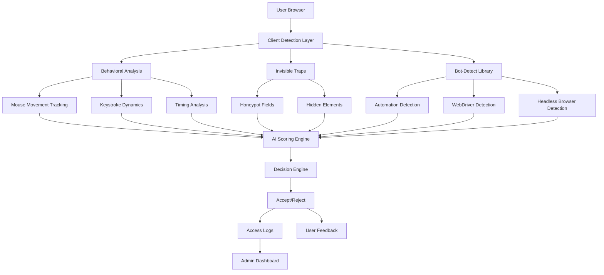
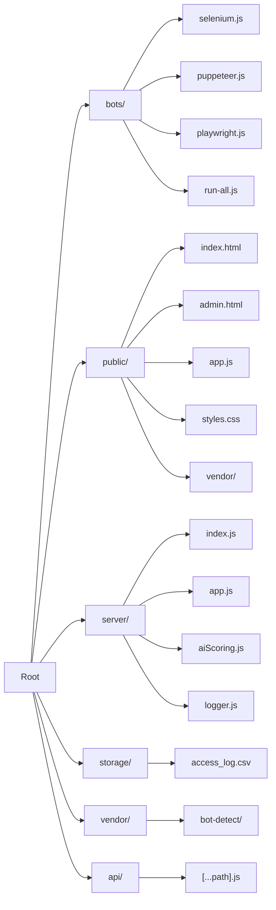
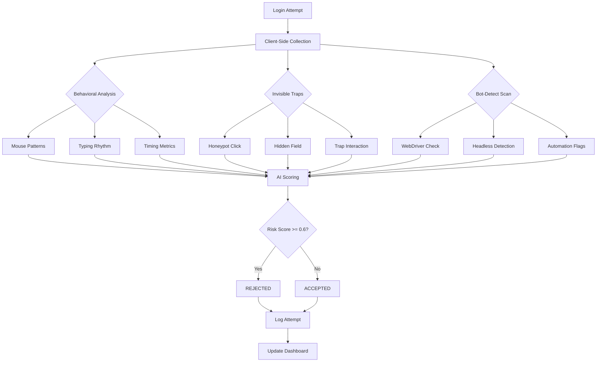

# Bot Detection with AI

An AI-powered behavioral bot detection and security analytics demo that focuses on the highest-value phase-one features for a portfolio project:

- Persistent security session logging with PostgreSQL-ready storage and file fallback
- Rule-based threat scoring with explainable evidence
- Automated response actions: allow, CAPTCHA, OTP, or block
- Security operations dashboard with filters, pagination, charts, and CSV export
- Explainable AI session detail panels for interview-friendly storytelling

## 🌟 Features

- **Persistent Logging**: Stores sessions and behavior events in PostgreSQL when configured, with automatic local JSON/CSV fallback for demos
- **Threat Scoring Engine**: Produces a 0-100 security score, threat level, prediction, and confidence with explicit reasons
- **Automated Response Engine**: Routes sessions into `ALLOW_ACCESS`, `SHOW_CAPTCHA`, `REQUIRE_OTP`, or `BLOCK_SESSION`
- **Explainable AI**: Shows the strongest risk or support signals for each verdict in both the login flow and the dashboard
- **Security Dashboard**: Includes metrics, filters, search, pagination, browser breakdown, daily detections, block trends, and CSV export
- **Bot Simulation**: Built-in Selenium, Puppeteer, and Playwright attack scripts for testing

## 🏗️ Architecture Overview



## 🚀 Quick Start

### Prerequisites
- **Node.js** 18+ and **npm** 9+
- **Chromium/Chrome** (for bot simulations)
- **Playwright browsers**: `npx playwright install` (optional)

### Installation

1. **Clone and install dependencies**:
   ```bash
   git clone https://github.com/abhiveeramallu/Bot-detection.git
   cd Bot-detection
   npm install
   ```

2. **Verify bot-detect bundle**:
   Ensure `public/vendor/botdetect.min.js` exists. If not, follow `public/vendor/README.md` to rebuild.

3. **Start the server**:
   ```bash
   npm start
   ```

4. **Access the application**:
   - **Login Page**: http://localhost:3000
   - **Admin Dashboard**: http://localhost:3000/admin.html

## 🎭 Bot Attack Simulation

Test the detection system with automated attacks:

```bash
# Selenium WebDriver attack
npm run bot:selenium

# Puppeteer-based attack
npm run bot:puppeteer

# Playwright-based attack
npm run bot:playwright

# Run all bots in sequence
npm run bot:all
```

*Run these commands while the server is running to see real-time detection in action.*
The bot scripts automatically solve the randomized CAPTCHA (word, math, or code).

### Target a Deployed URL
Send the bots to a live deployment using `BOT_TARGET_URL`:

```bash
BOT_TARGET_URL="https://your-project.vercel.app" npm run bot:all
```

Optional tuning:
- `BOT_TIMEOUT_MS=60000` to increase wait time
- `BOT_HEADLESS=false` to watch the bots run visually

## 📁 Project Structure



### Directory Details

- **`bots/`** - Automated attack scripts using popular automation frameworks
- **`public/`** - Frontend assets including login UI, admin dashboard, and client-side detection
- **`server/`** - Express.js backend with AI scoring, decision engine, and logging
- **`api/`** - Serverless entrypoint for Vercel (`api/[...path].js`)
- **`storage/`** - CSV access logs (git-ignored for privacy)
- **`vendor/`** - Third-party libraries including bot-detect

## 🔍 Detection Pipeline



## 📊 Detection Features

### Behavioral Analysis
- **Mouse Movement**: Track movement patterns, velocity, and natural vs robotic motion
- **Keystroke Dynamics**: Analyze typing rhythm, speed variations, and pause patterns
- **Timing Metrics**: Measure time to first click, form completion time, and interaction delays

### Invisible Traps
- **Honeypot Fields**: Hidden form fields that bots typically fill
- **Trap Elements**: Invisible buttons and links designed to catch automated interactions
- **CSS Traps**: Elements positioned off-screen or with zero opacity

### Automation Detection
- **WebDriver Detection**: Identify Selenium, Puppeteer, and Playwright automation
- **Headless Browser Flags**: Detect headless Chrome, Firefox, and WebKit
- **Plugin/Language Checks**: Verify browser fingerprint authenticity

### AI Scoring Engine
- **Multi-Feature Analysis**: Combines all signals into a unified risk score
- **Configurable Thresholds**: Adjustable sensitivity levels (default: 0.6)
- **Reason Generation**: Human-readable explanations for detection decisions

## 📈 Admin Dashboard Features

- **Real-time Statistics**: Live counts of accepted vs rejected attempts
- **Detailed Logs**: Comprehensive CSV export with all detection metrics
- **Visual Analytics**: Color-coded decisions and score visualizations
- **Filtering Options**: Sort by timestamp, decision, username, or risk factors

## 🔧 Configuration

### Thresholds
```javascript
const SCORE_THRESHOLD = 0.6;      // AI risk score threshold
const CAPTCHA_THRESHOLD = 0.6;     // CAPTCHA anomaly threshold
```

### Environment Variables
- `BOT_TARGET_URL` to point bot scripts at a deployed site.
- `BOT_TIMEOUT_MS` to increase bot wait time.
- `BOT_HEADLESS=false` to run bots in visible mode.
- `LOG_PATH` or `LOG_DIR` to control where CSV logs are written.

### Detection Features
The AI scoring engine analyzes:
- **CAPTCHA Metrics**: Challenge type, time to solve, retries, and answer match
- **Behavioral Signals**: Mouse movements, keystrokes, typing patterns
- **Automation Flags**: WebDriver, headless UA, missing plugins/languages
- **Trap Interactions**: Honeypot clicks, hidden field triggers

## 📝 Logging Format

Every login attempt is logged to `storage/access_log.csv` with:

```csv
timestamp,username,decision,label,reason,reasonSummary,aiScore,behaviorScore,automationScore,automationFlags,
botDetectDecision,botSignalCount,botDetectFlags,webdriver,headlessUA,pluginsLength,languagesLength,captchaScore,
captchaChallengeType,captchaTimeToSolveMs,captchaAttempts,captchaHoneypotTriggered,captchaActivationDelayMs,
captchaVerifiedClient,trapClicked,timeToFirstClickMs,timeToSubmitMs,mouseMoveCount,keystrokeCount,
typingDurationMs,typingCps,userAgent,platform,language,timezone
```

**Note**: `storage/*.csv` files are git-ignored to protect user privacy.

## 🛡️ Security & Privacy

- **Human-Friendly Messages**: Non-technical feedback that doesn't expose detection logic
- **Admin-Only Details**: Internal scoring and technical reasons restricted to logs
- **Local-First Operation**: No cloud services or external API calls required
- **Minimal Fingerprinting**: Privacy-conscious data collection (UA, platform, language, timezone)
- **No PII Storage**: Username sanitization and no personal information retention

## 🧪 Testing & Development

### Bot Simulation Scripts
Each bot script demonstrates different attack vectors:
- **Selenium**: Traditional WebDriver automation
- **Puppeteer**: Headless Chrome automation
- **Playwright**: Cross-browser automation framework

### Manual Testing
1. Start the server: `npm start`
2. Open http://localhost:3000 in a regular browser (should be accepted)
3. Run bot scripts (should be rejected)
4. Monitor results in admin dashboard

### Bot Testing (Local + Deployed)
Run bots from your local machine and target localhost or a deployed URL using `BOT_TARGET_URL`.

## ☁️ Vercel Deployment Notes
- API routes are handled by `api/[...path].js`, so `/api/login` and `/api/logs` work on Vercel.
- Logs are written to `/tmp/access_log.csv` in serverless environments (ephemeral). For persistence, set `LOG_PATH` or wire to external storage.
- The UI in `public/` is served automatically by Vercel.
- Run bots from your local machine using `BOT_TARGET_URL` to hit your deployed site.

## 🚀 Production Considerations

For production deployment, consider:
- **Admin Authentication**: Add access control to `/admin.html` and `/api/logs`
- **Rate Limiting**: Implement IP-based request throttling
- **CSRF Protection**: Add anti-CSRF tokens for form submissions
- **HTTPS**: Enable SSL/TLS for secure communication
- **Database**: Replace CSV logging with proper database storage
- **Scaling**: Consider load balancing for high-traffic scenarios

## 🤝 Contributing

1. Fork the repository
2. Create a feature branch: `git checkout -b feature-name`
3. Commit changes: `git commit -m 'Add feature description'`
4. Push to branch: `git push origin feature-name`
5. Submit a pull request

## 📄 License

This project is licensed under the MIT License - see the [LICENSE](LICENSE) file for details.

## 🙏 Acknowledgments

- **[bot-detect](https://github.com/AudriusVaskevicius/bot-detect)** - JavaScript bot detection library
- **Express.js** - Web framework for Node.js
- **Playwright, Puppeteer, Selenium** - Browser automation frameworks (for testing)

## 📞 Support

For questions, issues, or contributions:
- Create an issue on GitHub
- Check the existing documentation
- Review the bot simulation examples

---

**⚠️ Disclaimer**: This is a demo project for educational purposes. For production use, implement proper authentication, security hardening, and compliance measures.
